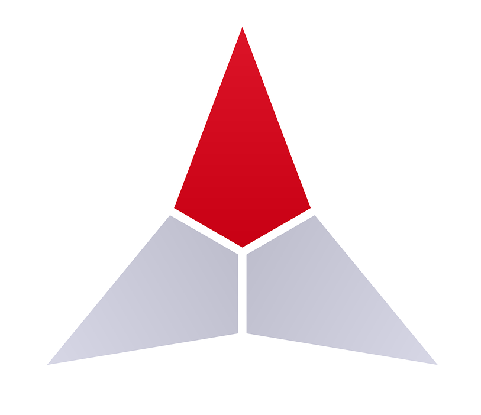

<h1 align="center">
  <br>
	
  <br>
  Bytekov 
  <br>
</h1>

<h4 align="center">A software organization thats seeks to build teams of developers with shared interests.</h4>
<!--
[![Contributors][contributors-shield]][contributors-url]
[![Forks][forks-shield]][forks-url]
[![Stargazers][stars-shield]][stars-url]
[![Issues][issues-shield]][issues-url]
[![MIT License][license-shield]][license-url]
[![LinkedIn][linkedin-shield]][linkedin-url]
-->
<p align="center">
  <a href="#registery">Registery repo</a> •
  <a href="#add-your-bio">Add your bio</a> •
  <a href="#tutorial">Github Tutorial</a> •
  <a href="#advanced">Learner team</a> •
  <a href="#learner">Developer team</a>
</p>

## Registery

* Collaboratioin
  - We will need you to be able to collaborate with us in order to be included in our projects
* Fork and clone
  - Each developer must be able to fork/clone make changes and commit their changes for collaboration
* Incoming developers
  - This repo allows incoming developers to update themselve into the project


## Add your bio

* Fork the repository
* Go to Advanced file (Advanced-Reg.md) or Learner file (Learner-Reg.md)
* Add your name and bio to the list
* Commit changes
* Create a pull request

To clone into local desktop ?? , you'll need [Git](https://git-scm.com) 
* From your command line:

```bash
# NOTE This is git bash commands !!!
# Clone this repository
$ git clone https://github.com/bytekov/registery

# Go into the repository
$ cd registery
```
* Then again continue ↓
* Go to Advanced file (Advanced-Reg.md) or Learner file (Learner-Reg.md)
* Add your name and bio to the list
* Commit changes
* Create a pull request
* 
## Tutorial

If you dont have any idea how to do this 

Learn how to do this from here → https://www.youtube.com/watch?v=a_FLqX3vGR4 

## Open source
This project uses the following open source packages:

- [Electron](http://electron.atom.io/)
- [Node.js](https://nodejs.org/)
- [Marked - a markdown parser](https://github.com/chjj/marked)
- [showdown](http://showdownjs.github.io/showdown/)
- [CodeMirror](http://codemirror.net/)
- Emojis are taken from [here](https://github.com/arvida/emoji-cheat-sheet.com)
- [highlight.js](https://highlightjs.org/)

## Advanced

Access advanced registery file here → https://github.com/bytekov/registery/blob/main/advanced.md

## Learner

Access learner registery file here → https://github.com/bytekov/registery/blob/main/learner.md

## License

GNU public license

---
> <!-- MARKDOWN LINKS & IMAGES -->
<!-- https://www.markdownguide.org/basic-syntax/#reference-style-links -->
[contributors-shield]: https://img.shields.io/github/contributors/othneildrew/Best-README-Template.svg?style=for-the-badge
[contributors-url]: https://github.com/othneildrew/Best-README-Template/graphs/contributors
[forks-shield]: https://img.shields.io/github/forks/othneildrew/Best-README-Template.svg?style=for-the-badge
[forks-url]: https://github.com/othneildrew/Best-README-Template/network/members
[stars-shield]: https://img.shields.io/github/stars/othneildrew/Best-README-Template.svg?style=for-the-badge
[stars-url]: https://github.com/othneildrew/Best-README-Template/stargazers
[issues-shield]: https://img.shields.io/github/issues/othneildrew/Best-README-Template.svg?style=for-the-badge
[issues-url]: https://github.com/othneildrew/Best-README-Template/issues
[license-shield]: https://img.shields.io/github/license/othneildrew/Best-README-Template.svg?style=for-the-badge
[license-url]: https://github.com/othneildrew/Best-README-Template/blob/master/LICENSE.txt
[linkedin-shield]: https://img.shields.io/badge/-LinkedIn-black.svg?style=for-the-badge&logo=linkedin&colorB=555
[linkedin-url]: https://linkedin.com/in/othneildrew
[product-screenshot]: images/screenshot.png
[Next.js]: https://img.shields.io/badge/next.js-000000?style=for-the-badge&logo=nextdotjs&logoColor=white
[Next-url]: https://nextjs.org/
[React.js]: https://img.shields.io/badge/React-20232A?style=for-the-badge&logo=react&logoColor=61DAFB
[React-url]: https://reactjs.org/
[Vue.js]: https://img.shields.io/badge/Vue.js-35495E?style=for-the-badge&logo=vuedotjs&logoColor=4FC08D
[Vue-url]: https://vuejs.org/
[Angular.io]: https://img.shields.io/badge/Angular-DD0031?style=for-the-badge&logo=angular&logoColor=white
[Angular-url]: https://angular.io/
[Svelte.dev]: https://img.shields.io/badge/Svelte-4A4A55?style=for-the-badge&logo=svelte&logoColor=FF3E00
[Svelte-url]: https://svelte.dev/
[Laravel.com]: https://img.shields.io/badge/Laravel-FF2D20?style=for-the-badge&logo=laravel&logoColor=white
[Laravel-url]: https://laravel.com
[Bootstrap.com]: https://img.shields.io/badge/Bootstrap-563D7C?style=for-the-badge&logo=bootstrap&logoColor=white
[Bootstrap-url]: https://getbootstrap.com
[JQuery.com]: https://img.shields.io/badge/jQuery-0769AD?style=for-the-badge&logo=jquery&logoColor=white
[JQuery-url]: https://jquery.com 

